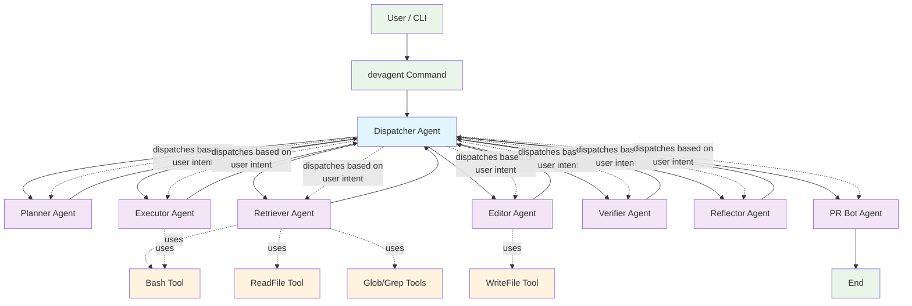

# Claude‑Code MVP – Technical Specification (MVP v0.1)

## 1) Problem & Features

Develop a local coding agent  that can: understand a task, retrieve relevant repo context, propose minimal diffs, run/tests in a sandbox, and create a PR with a clean description.

**MVP features**
- Python Language 
- Understand the codebase (file tree, symbols, dependencies)
- Add small new features
- Fix bugs and failing tests
- Propose and apply code changes with explanations
- GitHub integration
- Sanbox for Run/Test/Verify
- Humman in the loop for permision

**Non‑goals :**
- User-defined agents 
- MCP integration
- Editor integration (VS Code/Cursor)

---

## 2) User Stories

### Core Workflows

1. **Explore codebase**: "devagent explore" → agent analyzes project structure, identifies key components, maps dependencies, explains architecture and data flow
2. **Understand specific code**: "devagent explain src/auth.py" → agent reads file, analyzes context, explains purpose, dependencies, and how it fits into overall system  
3. **Small feature**: "devagent add GET /users/\:id" → adds handler, updates router/types, adds/updates tests
4. **Fix failing tests**: "devagent fix tests" → agent finds failure, edits code/tests, passes locally, opens PR
5. **Explain change**: Show rationale + risks in PR and inline code comments for tricky edits

---
## 3) System Overview

### 3.1 Components

**Entry**
- **Command (`devagent`)** – task entrypoint

**Agents**
- **Dispatcher** - Dispatch the query to subagent according to user's intent 
- **Planner** – produce structured work plan
- **Retriever** – search over codebase with tools like ls, read_file, grep, glob, etc.
- **Editor** – output unified diffs; Write files
- **Executor** – sandbox runner; test selection/execution
- **Verifier** – parse results; decide pass/fail and next actions
- **PR Bot** – creates PRs with title/body, attaches run logs, and adds inline review comments on risky hunks

**Tools**
- **Bash** - Executes a given bash command
- **ReadFile** - Reads a file from the local filesystem
- **WriteFile** - Write a file to the local filesystem

### 3.2 Architecture


### 4.1 Framework choices for a fast MVP

**Recommendation (Python‑first):** Use **LangGraph** for the agent state machine with **OpenAI function‑calling (or Claude Tools)** as the LLM interface. This hits the right balance of control, debuggability, and speed for a local CLI tool.

#### Orchestration / Agent frameworks

- **LangGraph** – Graph/Machine abstraction with checkpoints, branches, retries. Great for explicit *Plan → Retrieve → Edit → Run → Verify* loops. Easy to persist state and instrument. *→ Recommended.*
- **AutoGen** – Multi‑agent chat patterns. Good for research; heavier for deterministic patch loops.
- **Semantic Kernel** – Strong C# interop; decent Python. Heavier setup; plugins good, graphing less explicit than LangGraph.
- **LlamaIndex** – Excellent retrieval pipelines; can pair with LangGraph (use as your Retriever) or use its Agent/Graph if you want a single toolkit.
- **Haystack** – Mature RAG pipelines, evaluators; more documents‑centric than code agents but solid retrieval.
- **OpenAI Assistants / Anthropic Tool‑Use** – Quick start for tool‑calling, but less control over deterministic loops and local state.

#### Retrieval & indexing

- **tree‑sitter** for symbols/AST; **ripgrep** for lexical search; **sentence‑transformers** (bge‑small or MiniLM) + **FAISS** for embeddings.
- **SQLite** to store file metadata, symbol map, and chunk→embedding ids (simple, portable).

#### Diffing & patch safety

- Generate **unified diff** in the LLM; apply with `git apply --3way --reject` and a custom hunk validator.
- Optional AST guard: **libcst** (Python) or **ts‑morph** (TypeScript) to sanity‑check edits before apply.

#### Execution sandbox

- **Docker** + Python base image (`python:3.11-slim`), pinned toolchain (`pytest`, `ruff`, `black`).
- Runner via **subprocess** inside container; cap time/CPU/mem.

#### Minimal stack (copy‑paste ready)

- Orchestration: **LangGraph**
- LLM client: **openai/anthropic** SDK (function calling / tool use)
- Retrieval: **ripgrep**, **tree‑sitter**, **sentence‑transformers + FAISS**, **SQLite**
- Patching: **gitpython** or shell `git`, plus custom validator
- Sandbox: **Docker SDK for Python** or shell `docker`
- PRs: **PyGitHub** (or GitHub App via REST)

#### Tiny LangGraph skeleton

```python
from langgraph import StateGraph, END
from typing import TypedDict, Literal
from langgraph.prebuilt import ToolNode

class AgentState(TypedDict):
    goal: str
    user_intent: Literal["explore", "explain", "feature", "fix", "pr"]
    plan: dict
    context: str
    diff: str
    run_result: dict
    verdict: Literal["pass", "fail", "error"]
    iter: int
    current_agent: str
    error_msg: str

# Tools available to agents
tools = {
    "bash": bash_tool,           # Execute bash commands
    "read_file": read_file_tool, # Read files from filesystem  
    "write_file": write_file_tool, # Write files to filesystem
    "glob": glob_tool,           # Find files by pattern
    "grep": grep_tool,           # Search in files
}

# Multi-agent dispatcher architecture
g = StateGraph(AgentState)

# Agent implementations with tool usage
def dispatcher_agent(state: AgentState) -> AgentState:
    """Analyzes user intent and dispatches to appropriate agent"""
    intent = classify_user_intent(state["goal"])  # LLM call to classify intent
    return {
        **state,
        "user_intent": intent,
        "current_agent": get_agent_for_intent(intent)
    }

def planner_agent(state: AgentState) -> AgentState:
    """Creates execution plan using repo summary"""
    # Use tools to gather repo information
    repo_summary = tools["bash"]("find . -name '*.py' | head -20")
    plan = create_plan(state["goal"], repo_summary)
    
    next_agent = "retriever" if state["user_intent"] in ["feature", "fix"] else "pr_bot"
    return {
        **state,
        "plan": plan,
        "current_agent": next_agent
    }

def retriever_agent(state: AgentState) -> AgentState:
    """Gathers relevant context using file tools"""
    plan = state["plan"]
    context_files = []
    
    # Use glob to find relevant files
    for pattern in plan.get("file_patterns", ["*.py"]):
        files = tools["glob"](pattern)
        context_files.extend(files)
    
    # Read relevant files
    context = ""
    for file_path in context_files[:5]:  # Limit context
        content = tools["read_file"](file_path)
        context += f"\n--- {file_path} ---\n{content}"
    
    return {
        **state,
        "context": context,
        "current_agent": "editor"
    }

def editor_agent(state: AgentState) -> AgentState:
    """Generates code changes using write tools"""
    # Generate diff based on plan and context
    diff = generate_diff(state["plan"], state["context"])
    
    # Apply changes using write_file tool
    for file_change in diff.get("files", []):
        tools["write_file"](file_change["path"], file_change["content"])
    
    return {
        **state,
        "diff": diff,
        "current_agent": "executor"
    }

def executor_agent(state: AgentState) -> AgentState:
    """Runs tests using bash tool"""
    # Run tests in sandbox
    test_cmd = state["plan"].get("test_command", "python -m pytest")
    result = tools["bash"](test_cmd)
    
    return {
        **state,
        "run_result": result,
        "current_agent": "verifier"
    }

def verifier_agent(state: AgentState) -> AgentState:
    """Analyzes results and determines next action"""
    verdict = parse_test_results(state["run_result"])
    
    if verdict == "pass":
        next_agent = "pr_bot"
    elif state.get("iter", 0) >= 5:
        next_agent = "end"
    else:
        next_agent = "reflector"
    
    return {
        **state,
        "verdict": verdict,
        "current_agent": next_agent
    }

def reflector_agent(state: AgentState) -> AgentState:
    """Reflects on failure and updates plan"""
    updated_plan = reflect_and_replan(state["plan"], state["error_msg"])
    return {
        **state,
        "plan": updated_plan,
        "iter": state.get("iter", 0) + 1,
        "current_agent": "retriever"
    }

def pr_bot_agent(state: AgentState) -> AgentState:
    """Creates PR using bash/git tools"""
    # Create PR using git commands
    pr_url = tools["bash"]("gh pr create --title 'Agent changes' --body 'Auto-generated'")
    return {
        **state,
        "pr_url": pr_url,
        "current_agent": "end"
    }

# Helper functions
def get_agent_for_intent(intent: str) -> str:
    intent_mapping = {
        "explore": "pr_bot",      # Direct to explanation output
        "explain": "pr_bot",      # Direct to explanation output  
        "feature": "planner",     # Need planning for features
        "fix": "planner",         # Need planning for fixes
        "pr": "pr_bot"            # Direct to PR creation
    }
    return intent_mapping.get(intent, "planner")

# Add all nodes
g.add_node("dispatcher", dispatcher_agent)
g.add_node("planner", planner_agent)
g.add_node("retriever", retriever_agent)
g.add_node("editor", editor_agent)
g.add_node("executor", executor_agent)
g.add_node("verifier", verifier_agent)
g.add_node("reflector", reflector_agent)
g.add_node("pr_bot", pr_bot_agent)

# Dispatcher routing logic
def agent_router(state: AgentState) -> str:
    current_agent = state.get("current_agent", "dispatcher")
    return current_agent if current_agent != "end" else END

# Connect nodes - all agents return to router
g.add_conditional_edges("dispatcher", agent_router)
for agent in ["planner", "retriever", "editor", "executor", "verifier", "reflector"]:
    g.add_conditional_edges(agent, agent_router)
g.add_edge("pr_bot", END)

g.set_entry_point("dispatcher")
engine = g.compile()
```

---

## 5) Evaluation Framework

### 5.1 Success Metrics (Automated)

**Task Completion Metrics**
- **End-to-End Success Rate**: % of tasks completed from plan to PR without human intervention
- **Test Pass Rate**: % of generated code that passes existing test suites
- **Build Success Rate**: % of changes that compile/build without errors
- **Patch Apply Rate**: % of generated unified diffs that apply cleanly with `git apply`

**Quality Metrics**
- **Code Quality Scores**: Static analysis metrics (cyclomatic complexity, maintainability index)
- **Diff Minimality**: `lines_changed / functionality_points` ratio
- **Test Coverage**: % of new code covered by tests (existing + agent-generated)
- **Convention Adherence**: % compliance with linting rules (ruff, black, etc.)

**Performance Metrics**
- **Task Completion Time**: Average time from user input to PR creation
- **Iteration Count**: Average retry cycles needed per successful task
- **Context Efficiency**: Tokens used vs. task complexity

### 5.2 Human Evaluation

**Code Review Quality (1-5 Likert Scale)**
- **Readability**: Code clarity and documentation quality
- **Correctness**: Logic accuracy and edge case handling  
- **Maintainability**: Future-proofing and extensibility
- **Security**: Absence of vulnerabilities and best practices

**PR Quality Assessment**
- **Description Clarity**: How well PR explains rationale and changes
- **Reviewer Burden**: Average comments/change requests per PR
- **Merge Acceptance Rate**: % of PRs merged without major revisions
- **Time to Merge**: Hours from PR creation to merge

### 5.3 Benchmark Datasets

#### 5.3.1 Synthetic Test Repository

**Repository Structure:**
```
devagent-bench/
├── simple-flask-api/     # REST API with SQLite
├── data-pipeline/        # ETL scripts with pandas
├── cli-tool/            # Click-based command line app
└── microservice/        # Python service + PostgreSQL
```

**Task Categories by Complexity:**

**Level 1: Simple Tasks (baseline)**
- Add new REST endpoint with validation
- Fix obvious bug (missing import, typo)
- Add unit test for existing function
- Update dependency version in requirements.txt

**Level 2: Medium Tasks**
- Implement new business logic with database changes
- Refactor function to improve performance
- Add error handling and logging
- Fix failing integration test

**Level 3: Complex Tasks**
- Design and implement new feature across multiple files
- Debug race condition or concurrency issue
- Optimize database queries and add indexes
- Implement authentication/authorization

#### 5.3.2 Real-World Task Dataset

**Open Source Repository Tasks:**
- Collect issues labeled "good first issue" from popular Python repos
- Create reproducible task descriptions with success criteria
- Maintain ground truth solutions from actual merged PRs

**Task Examples:**
```yaml
task_001:
  description: "Add user profile endpoint to Flask API"
  repo: "simple-flask-api"
  files_expected: ["app.py", "models.py", "test_users.py"]
  success_criteria:
    - GET /users/:id returns user data
    - Handles 404 for missing users
    - Includes input validation
    - Has unit tests with >90% coverage
```

### 5.4 Evaluation Pipeline

#### 5.4.1 Automated Testing

**Pre-commit Evaluation:**
```python
def evaluate_agent_pr(pr_diff, base_repo):
    metrics = {}
    
    # Apply diff and run tests
    metrics['patch_applies'] = apply_diff_safe(pr_diff, base_repo)
    metrics['tests_pass'] = run_test_suite(base_repo)
    metrics['builds'] = run_build_command(base_repo)
    
    # Static analysis
    metrics['lint_score'] = run_linter(base_repo)
    metrics['complexity'] = calculate_complexity(pr_diff)
    
    # Coverage analysis
    metrics['coverage_delta'] = measure_coverage_change(pr_diff)
    
    return metrics
```

**Benchmark Runner:**
```bash
# Run evaluation suite
devagent-eval --dataset=benchmark-v1.0 --agent=devagent --output=results.json

# Generate report
devagent-eval report --results=results.json --format=html
```

#### 5.4.2 Human Review Process

**Review Protocol:**
1. **Blind Review**: Reviewers don't know if code is human or agent-generated
2. **Standardized Rubric**: 5-point scale across readability, correctness, maintainability
3. **Multiple Reviewers**: At least 2 reviewers per task for inter-rater reliability
4. **Feedback Collection**: Specific comments on what could be improved

**Reviewer Pool:**
- Senior engineers (3+ years experience)
- Domain experts for specific task types
- Mix of internal team + external contractors

### 5.5 Success Thresholds (MVP Targets)

**MVP Acceptance Criteria:**
- **Task Completion Rate**: >70% for Level 1 tasks, >40% for Level 2
- **Test Pass Rate**: >90% (should not break existing functionality)
- **Human Review Score**: >3.5/5.0 average across all dimensions
- **Patch Apply Rate**: >95% (diffs must be syntactically correct)

**Production Readiness Targets:**
- **Task Completion Rate**: >90% for Level 1, >70% for Level 2, >30% for Level 3
- **Security Score**: 0 critical vulnerabilities introduced
- **Performance**: <10% regression in runtime/memory for modified code
- **Developer Satisfaction**: >4.0/5.0 in usability surveys

### 5.6 Continuous Evaluation

**Production Monitoring:**
- Track success rates on real developer tasks
- Monitor post-deployment bug rates for agent-generated code
- Collect developer feedback through in-CLI surveys
- A/B testing: agent vs. manual coding for similar tasks

**Model Improvement Loop:**
- Use failed tasks to create additional training examples
- Analyze common failure patterns to improve prompts
- Regularly update benchmark datasets with new task types
- Version control evaluation results to track progress over time

---

## Appendix: Alternative Stacks & Trade‑offs

### Orchestration / Agents

| Option                       | Strengths                                             | Weaknesses                                           | Use when                                           |
| ---------------------------- | ----------------------------------------------------- | ---------------------------------------------------- | -------------------------------------------------- |
| **Plain Python loop**        | Fastest to start, zero deps, total control            | No built‑ins for retries/branches/checkpointing      | POC in 1–2 days; you'll add LangGraph later        |
| **LangGraph**                | Deterministic graphs, state checkpoints, good tooling | Another dep; learning curve                          | You want reliability + observability from week 1   |
| **OpenAI Assistants**        | Quick tool‑use, hosted memory, eval UI                | Less control over state; vendor‑lock; harder offline | Hack together quickly without custom orchestration |
| **Anthropic Tool‑Use**       | Strong model reasoning, simple tool calls             | Fewer orchestration primitives                       | You stay Anthropic‑only and want simplicity        |
| **AutoGen**                  | Multi‑agent patterns, rich examples                   | Chatty, more complex, nondeterministic               | Researching agent roles; not strict patch loops    |
| **LlamaIndex (Agent/Graph)** | Integrated RAG + agents, observability                | Heavier; opinionated                                 | You want a one‑stop data+agent toolkit             |
| **Semantic Kernel**          | Plugins, planners, C# first                           | Python less mature; graphing weaker                  | .NET shop, VS/Windows integration                  |
| **Haystack Agents**          | Solid RAG, evaluators                                 | Docs‑centric, limited code‑agent patterns            | Strong doc RAG + light agent needs                 |

### Retrieval / Indexing

| Option                              | Strengths                                  | Weaknesses                               | Use when                                        |
| ----------------------------------- | ------------------------------------------ | ---------------------------------------- | ----------------------------------------------- |
| **ripgrep + tree‑sitter + SQLite**  | Local‑first, simple, fast, great precision | DIY ranking, ops on you                  | MVP with tight control, no external services    |
| **LlamaIndex vector + graph**       | Many loaders, composable retrievers        | Extra complexity; cost if hosted         | Want advanced retrieval quickly                 |
| **Haystack (Elasticsearch/Qdrant)** | Production RAG plumbing                    | Service to run; tuning                   | You already have ES/Qdrant and ops              |
| **FAISS (local)**                   | Zero‑server, fast ANN                      | In‑memory unless you persist; no filters | Single‑repo, small/medium codebases             |
| **Qdrant/Weaviate/pgvector**        | Filters, persistence, scale                | Another service to operate               | Multi‑repo, team‑wide code memory               |
| **Sourcegraph src‑cli**             | Best‑in‑class code search                  | External dependency                      | Enterprise repos; avoid writing your own search |

### Patch / Editing Strategy

| Strategy                                        | Strengths                               | Weaknesses                                | Use when                                  |
| ----------------------------------------------- | --------------------------------------- | ----------------------------------------- | ----------------------------------------- |
| **LLM unified diff**                            | Minimal changes, reviewable, git‑native | Can drift/patch‑fail; needs validator     | Default for small fixes/features          |
| **AST code‑mods (libcst/ts‑morph/jscodeshift)** | Structurally safe, repeatable           | Harder prompts; limited for creative code | Bulk mech changes, refactors, API renames |
| **LSP text edits**                              | Position‑accurate, language‑aware       | Implementing LSP infra is heavier         | Editor‑integrated fine‑grained edits      |

### Execution / Sandbox

| Option                  | Strengths                    | Weaknesses                        | Use when                    |
| ----------------------- | ---------------------------- | --------------------------------- | --------------------------- |
| **Local subprocess**    | Fast, zero infra             | Pollutes env; non‑reproducible    | Hackiest MVP on your laptop |
| **Docker/Podman**       | Reproducible, safe, portable | Startup overhead                  | Default for MVP + CI parity |
| **Nix**                 | Reproducible dev envs        | Learning curve; slower first‑time | Teams already on Nix        |
| **Firecracker/microVM** | Strong isolation             |                                   |                             |

